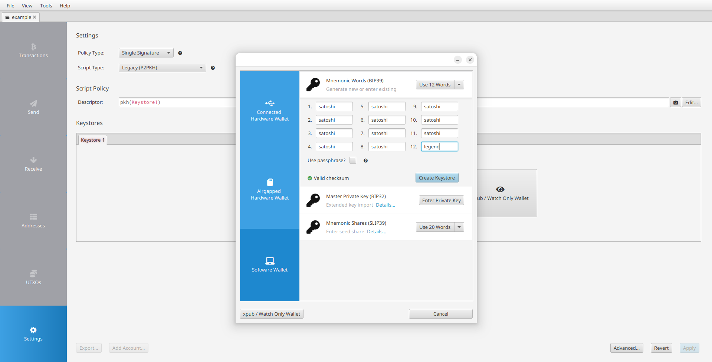
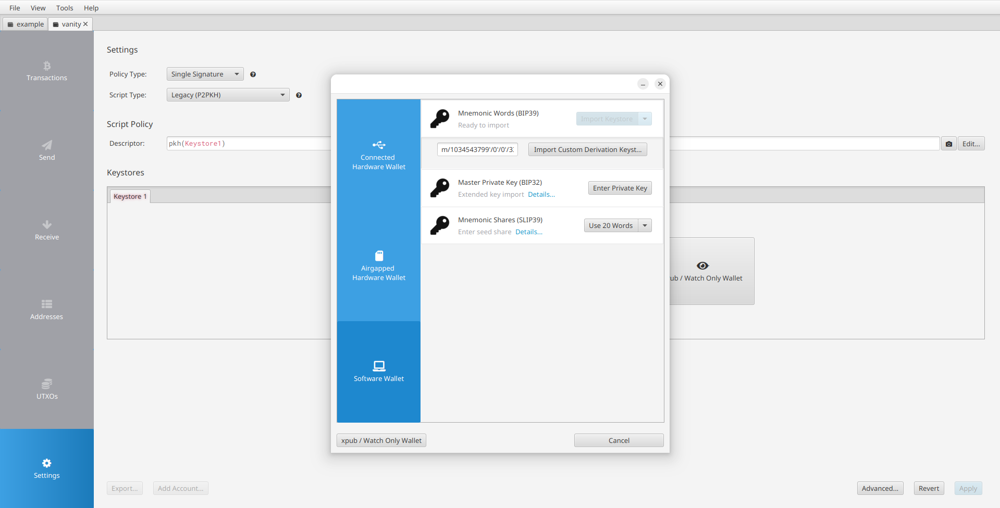
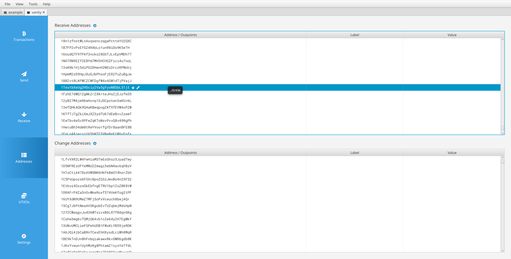

# Address Artisan

Address Artisan is a vanity Bitcoin address generator based on [BIP32](https://github.com/bitcoin/bips/blob/master/bip-0032.mediawiki) xpub key derivation and is:

- 🔒 **Secure**: Generates vanity addresses even for hardware wallets! 🤯
- ⚡ **Fast**: Built in Rust/OpenCL with fast public key derivation, prefix matching and GPU support. 🚀
- 🎯 **Versatile**: Supports both "Legacy" (P2PKH) and Native SegWit (P2WPKH). Your address, your style! 🎉

## Get the Address Artisan

You can install the tool using:

```bash
cargo install address-artisan
```

Or clone the repository and build it:

```bash
cargo build --release
```

## Usage

The tool requires 2 mandatory arguments (`xpub` and `prefix`) and accepts several optional arguments:

- `--xpub` (`-x`): Extended public key (obtainable from almost any Bitcoin wallet)
- `--prefix` (`-p`): Desired address prefix (must start with "1" or "bc1q")
- `--num-addresses` (`-n`): Number of addresses to find before stopping automatically (default: 1, 0 = never stop). Useful for generating multiple vanity addresses in a single run
- `--max-depth` (`-m`): Maximum depth of the last derivation path (default: 1000). A larger max-depth means better utilization of the key space and cache. However, an address may get buried in a large gap, and since [account discovery](https://github.com/bitcoin/bips/blob/master/bip-0044.mediawiki#user-content-Account_discovery) is designed to be sequential, it may take time for the wallet to find it after increasing the gap limit. Testing suggests 100,000 is an optimal value, causing only a 3-second wallet freeze during setup.
- `--cpu-threads` (`-t`): Number of CPU threads to use (default: 0 = auto-detect physical cores)
- `--gpu` (`-g`): Enable GPU processing (excludes integrated/onboard GPUs). Can optionally specify GPU IDs: `--gpu 0,1` or `--gpu 0 1`. Without IDs, all available GPUs are used
- `--gpu-only`: Use only GPU for processing (no CPU, excludes integrated/onboard GPUs). Can be combined with `--gpu` to specify which GPUs to use

For detailed information, use the help command:

```bash
address-artisan --help
```

### Device Selection Examples

```bash
# CPU only (auto-detect cores)
address-artisan -x <xpub> -p <prefix>

# CPU with 8 threads
address-artisan -x <xpub> -p <prefix> -t 8

# Use all available GPUs + CPU
address-artisan -x <xpub> -p <prefix> --gpu

# Use GPU 0 + CPU
address-artisan -x <xpub> -p <prefix> --gpu 0

# Use GPU 0 and GPU 2 + CPU
address-artisan -x <xpub> -p <prefix> --gpu 0,2

# Use all GPUs, no CPU
address-artisan -x <xpub> -p <prefix> --gpu-only

# Use only GPU 1, no CPU
address-artisan -x <xpub> -p <prefix> --gpu 1 --gpu-only

# Use GPUs 0 and 1, plus CPU with 4 threads
address-artisan -x <xpub> -p <prefix> --gpu 0 1 -t 4
```

**Note:** If you specify an invalid GPU ID, the program will display the available GPUs on your system. Integrated/onboard GPUs are automatically excluded.

For a complete walkthrough with all steps and details, check the [Example](#example) section.

## ⚠️ **WARNING**

Yes, it's completely safe to use this tool. But be aware of the following:

- Don't send funds to the vanity address without first confirming it appears in the addresses list.
- Store the derivation path and address index to always be able to recover funds. It's even possible to save them on the [Bitcoin Blockchain](https://en.bitcoin.it/wiki/OP_RETURN).

Again, see the [Example](#example) section for a complete and safe walkthrough.

## BIP44 Compliance

While this tool is **not** (and cannot be) compliant with [BIP44](https://github.com/bitcoin/bips/blob/master/bip-0044.mediawiki), it can be used with BIP44-compliant wallets. Here's how it works:

BIP44 standardizes 5 levels of derivation:

```
m / purpose' / coin_type' / account' / change / address_index
```

Where:

- `m`: Master key
- `purpose'`: Purpose identifier following [BIP43](https://github.com/bitcoin/bips/blob/master/bip-0043.mediawiki) (e.g., 44' for P2PKH)
- `coin_type'`: Coin identifier, following [SLIP44](https://github.com/satoshilabs/slips/blob/master/slip-0044.md). 0' (0x80000000) for Bitcoin
- `account'`: Account number for funds organization - greater than or equal to 0' (0x80000000)
- `change`: Like a boolean flag - 0 (0x00) for receive addresses, 1 (0x01) for change addresses
- `address_index`: Address index

This tool brute-forces a path of the form:

```
xpub_path' / seed0 / seed1 / b / a / 0 / address_index
```

Where:

- `xpub_path'`: User-provided hardened derivation path
- `seed0/seed1`: 62-bit entropy for unique key space per run - each less than 0' (0x80000000)
- `b/a`: Two derivation paths for key space expansion - each less than 0' (0x80000000)
- `0`: Constant 0 (0x00) for BIP44-compliant wallet compatibility
- `address_index`: Address index within the account - less than _max_depth_ CLI argument

By maintaining 0 as the second-to-last derivation path, BIP44-compliant wallets will recognize the vanity address as the *address_index*th receive address when using `xpub_path' / seed0 / seed1 / b / a` as the wallet's input path.

## Example

The following example demonstrates the complete process of generating and using a vanity address with this tool. The [Sparrow](https://github.com/sparrowwallet/sparrow) wallet will be used for this demonstration.

### Get the xpub

First, a working wallet needs to be set up.

It's recommended to create a new wallet with a custom derivation path using a dedicated purpose for vanity addresses. There's no need to generate a new seed phrase or reset the hardware wallet - using a different derivation path allows keeping existing wallet funds completely separate.

1. Create a new wallet

Create a new wallet using either your seed phrase/private key or your hardware wallet.



2. On the next screen, set up the derivation path. I propose to use the following path:

```
m/10495330'/0'/0'
```

This path uses:

- Purpose: 10495330' (which spells "vnty" in base58) for vanity addresses
- Coin type: 0' (0x80000000) for Bitcoin ([SLIP44](https://github.com/satoshilabs/slips/blob/master/slip-0044.md))
- Account: 0' (0x80000000)

Note: Make sure to include the ' after each number to ensure hardened derivation.


3. The next screen will display the xpub. In this example:
   `xpub6DRyCVn7t9e3DjUphcExjExY7NMw6mC4ZqzKZT8knao5YbVZ5iNHdaj1SibbsVdyreoWqeMPrNcNv7fbwLpmY2PrEQ8ttdtsdBy6fvpUoMk`

This value should be copied for the next step.


### Generate the Vanity Address

Run the tool with the xpub and desired prefix:

```
address-artisan --xpub xpub6DRyCVn7t9e3DjUphcExjExY7NMw6mC4ZqzKZT8knao5YbVZ5iNHdaj1SibbsVdyreoWqeMPrNcNv7fbwLpmY2PrEQ8ttdtsdBy6fvpUoMk --prefix 1TEST
```

The tool will output three pieces of information:

```
Address: 1TEST9ecYeUg31ZxLrJ7e3ScYpkyRUjSr
Path: xpub_path'/1949567566/243133792/0/175
Address index: 158473
```

Where:

- `xpub_path'` represents the initial derivation path (`m/10495330'/0'/0'` if following the guide above)

The complete derivation path for this address is `m/10495330'/0'/0'/1949567566/243133792/0/175/0/158473`

### Import the Address in the Wallet

1. Create a new wallet using the same seed phrase or hardware wallet. Make sure to choose the correct script type that matches your prefix: Native SegWit (P2WPKH) for addresses starting with "bc1q", or "Legacy" (P2PKH) for addresses starting with "1".


2. On the next screen, use the derivation path returned by the tool. In this example: `m/10495330'/0'/0'/1949567566/243133792/0/175`



3. Since software wallets use a default [gap limit](https://github.com/bitcoin/bips/blob/master/bip-0044.mediawiki#address-gap-limit) of 20 addresses, this needs to be adjusted in the Advanced settings. The gap limit should be set to a value higher than the address index.


### Verify the Address

1. In the Addresses tab, scroll down to the receive address index to verify the vanity address appears correctly.



2. Once confirmed, the address is ready to receive funds securely. Double-click the address to open the default Receive screen.


That's it! Easy, secure and awesome 😎👍

## Credits

This project is inspired by and builds upon the work of:

- **Kai Wolfram**, with [Senzu](https://github.com/kaiwolfram/senzu) - The original inspiration for this project, providing the foundation for BIP32-based vanity address generation
- **samr7**, with [Vanitygen](https://github.com/samr7/vanitygen) - The pioneering Bitcoin vanity address generator, particularly for the range-based hash160 matching technique
- **Peter Dettman**, with the [addition chain implementation](https://github.com/bitcoin-core/secp256k1/commit/f8ccd9befdb22824ef9a845a90e3db57c1307c11) - The efficient modular inverse calculation using Fermat's Little Theorem with an addition chain for secp256k1's p-2

Special thanks to:

- **Hal Finney** (RIP) - For _probably_ creating Bitcoin 😉
