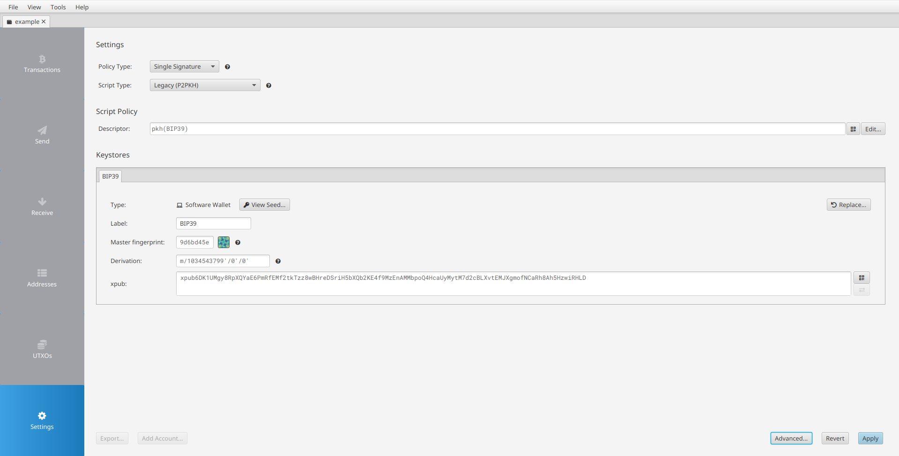

# THIS BRANCH

This branch is an experimental branch to get the Artisan working on the GPU using OpenCL.To get the working CPU version, go to the [main branch](https://github.com/seaasses/address-artisan/tree/main).

# Address Artisan

Address Artisan is a vanity Bitcoin P2PKH address generator based on [BIP32](https://github.com/bitcoin/bips/blob/master/bip-0032.mediawiki) xpub key derivation.

This software is inspired by [Senzu](https://github.com/kaiwolfram/senzu) and aims to be:

- 🔒 **Secure**: Generate vanity addresses even for hardware wallets! 🤯
- ⚡ **Fast**: Built in Rust with fast public key derivation and prefix matching. 🚀
- 😎 **Cool**: "1There1sNoSpoon" is much cooler than "bc1qtheresn0sp00n". P2PKH wins! 🎉

## Get the Tool

You can install the tool using:

```
cargo install address-artisan
```

Or clone the repository and build it:

```
cargo build --release
```

## Usage

The tool requires 2 mandatory arguments (`xpub` and `prefix`) and can take 1 optional argument (`max-depth`), and 1 optional flag (`i-am-boring`):

- `xpub`: Extended public key (obtainable from almost any Bitcoin wallet)
- `prefix`: Desired address prefix (must start with "1")
- `max-depth`: Maximum depth of the last derivation path. A larger max-depth means better utilization of the key space and cache. However, an address may get buried in a large gap, and since [account discovery](https://github.com/bitcoin/bips/blob/master/bip-0044.mediawiki#user-content-Account_discovery) is designed to be sequential, it may take time for the wallet to find it after increasing the gap limit. Testing suggests 100,000 is an optimal value, causing only a 3-second wallet freeze during setup.
- `i-am-boring`: For those who prefer more serious logging output (but be warned, the Artisan won't be pleased!)

For detailed information, use the help command:

```
address-artisan --help
```

For a complete walkthrough with all steps and details, check the [Example](#example) section.

## ⚠️ **WARNING**

Yes, it's completely safe to use this tool. But be aware of the following:

- Don't send funds to the vanity address without first confirming it appears in your addresses list.
- Store the derivation path and address index so you can always recover your funds. It's even possible to save them on the [Bitcoin Blockchain](https://en.bitcoin.it/wiki/OP_RETURN).

Again, see the [Example](#example) section for a complete and safe walkthrough.

## BIP44 Compliance

While this tool is **not** (and cannot be) compliant with [BIP44](https://github.com/bitcoin/bips/blob/master/bip-0044.mediawiki), it can be used with BIP44-compliant wallets. Here's how it works:

BIP44 standardizes 5 levels of derivation:

```
m / purpose' / coin_type' / account' / change / address_index
```

Where:

- `m`: Master key
- `purpose'`: Constant 44' (0x8000002C) - following [BIP43](https://github.com/bitcoin/bips/blob/master/bip-0043.mediawiki)
- `coin_type'`: Coin identifier, following [SLIP44](https://github.com/satoshilabs/slips/blob/master/slip-0044.md). 0' (0x80000000) for Bitcoin
- `account'`: Account number for fund organization - greater than 0' (0x80000000)
- `change`: Boolean flag - 0 (0x00) for receive addresses, 1 (0x01) for change addresses
- `address_index`: Address index

This tool brute-forces a path of the form:

```
xpub_path' / random_number / <n derivation paths> / 0 / address_index
```

Where:

- `xpub_path'`: User-provided hardened derivation path
- `random_number`: Randomly generated number for unique key space per run - less than 0' (0x80000000)
- `<n derivation paths>`: One or more derivation paths for key space expansion - each less than 0' (0x80000000)
- `0`: Constant 0 (0x00) for BIP44-compliant wallet compatibility
- `address_index`: Address index within the account - less than _max_depth_ CLI argument

By maintaining 0 as the second-to-last derivation path, BIP44-compliant wallets will recognize the vanity address as the *address_index*th receive address when using `xpub_path' / random_number / <n derivation paths>` as the wallet's input path.

## Example

The following example demonstrates the complete process of generating and using a vanity address with this tool. The [Sparrow](https://github.com/sparrowwallet/sparrow) wallet will be used for this demonstration.

### Get the xpub

First, you'll need to set up a working wallet that supports the P2PKH script type.

If you already have a P2PKH wallet (which is unlikely since most modern wallets default to SegWit), it's recommended to create a new one with a custom derivation path. You won't need to generate a new seed phrase or reset your hardware wallet - using a different derivation path allows you to keep your existing wallet funds completely separate.

1. Create a new P2PKH wallet by selecting _P2PKH_ as the script type.


2. On the next screen, set up the derivation path. I purpose to use the following path:

```
m/1034543799'/0'/0'
```

This path uses:

- Purpose: 1034543799' (0xBDA9E2B7) for vanity addresses
- Coin type: 0' (0x80000000) for Bitcoin ([SLIP44](https://github.com/satoshilabs/slips/blob/master/slip-0044.md))
- Account: 0' (0x80000000)

Note: Make sure to include the ' after each number to ensure hardened derivation.


3. The next screen will display your xpub. In this example, it's:
   `xpub6DK1UMgy8RpXQYaE6PmRfEMf2tkTzz8wBHreDSriH5bXQb2KE4f9MzEnAMMbpoQ4HcaUyMytM7d2cBLXvtEMJXgmofNCaRh8Ah5HzwiRHLD`

Copy this value for the next step.



### Generate the Vanity Address

Run the tool with your xpub and desired prefix:

```
address-artisan --xpub xpub6DK1UMgy8RpXQYaE6PmRfEMf2tkTzz8wBHreDSriH5bXQb2KE4f9MzEnAMMbpoQ4HcaUyMytM7d2cBLXvtEMJXgmofNCaRh8Ah5HzwiRHLD --prefix 1Test
```

The tool will output three pieces of information:

```
Address: 1TestbXeUg2HDciy2Va5gYyoN8SbL51jt
Derivation path: xpub'/335682406/36995
Receive address index: 436
```

Where:

- `xpub'` represents your initial derivation path (`m/1034543799'/0'/0'` if you followed the guide above)

The complete derivation path for this address is `m/1034543799'/0'/0'/335682406/36995/0/436`

### Import the Address in Your Wallet

1. Create a new P2PKH wallet using the same seed phrase or hardware wallet, but this time use the derivation path returned by the tool.


In this example, use: `m/1034543799'/0'/0'/335682406/36995`

2. Since software wallets uses a default gap of 20 addresses, you'll need to adjust this in the Advanced settings. Set the gap limit to a value higher than your address index.


### Verify the Address

1. In the Addresses tab, scroll down to your receive address index and verify that you see your vanity address.


2. Once confirmed, the address is ready to receive funds securely. Double-click the address to open the default Receive screen.


